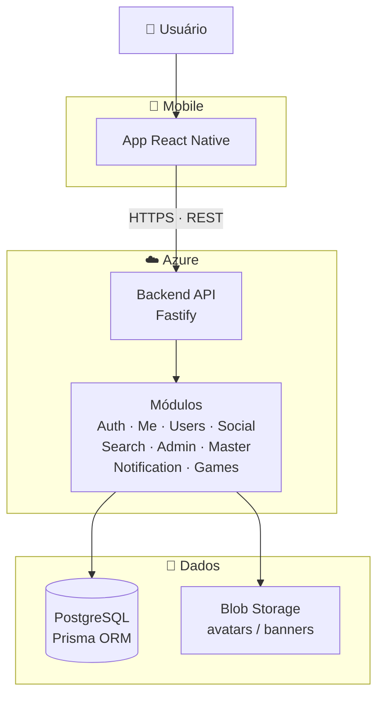

# Nexo API

API REST para plataforma de reviews e social de jogos. Autenticação JWT, perfis públicos, feed social, sistema de busca, moderação e dashboard administrativo.

## Funcionalidades

- **Autenticação** — registro, login, refresh token, recuperação de senha
- **Perfil próprio** — gerenciar username, bio, avatar e banner
- **Upload de imagens** — avatar e banner via multipart, armazenamento local com `@fastify/static`
- **Perfis públicos** — consultar usuários, reviews, estatísticas e listas de jogos
- **Social** — seguir/deixar de seguir, lista de seguidores e seguindo, feed de reviews
- **Busca textual** — busca por username com índice `pg_trgm` (O(log n))
- **Módulo Admin** — dashboard de métricas, CRUD de usuários, bloqueio, moderação de reviews, denúncias
- **Master** — promover/demover/banir usuários
- **Notificações** — listar, marcar como lidas, deletar
- **Rate limit** — 40 requisições/minuto global
- **Documentação Swagger** — rota `/docs`

## Stack

| Camada | Tecnologia |
|---|---|
| Runtime | Node.js 22 + TypeScript |
| Framework | Fastify 4 |
| ORM | Prisma 7 |
| Banco | PostgreSQL 16 |
| Autenticação | JWT (`@fastify/jwt`) + Argon2 |
| Upload | `@fastify/multipart` + `@fastify/static` |
| Testes | Vitest |
| Formatação | Biome |
| Container | Docker + docker-compose |
| CI | Azure Pipelines |

## Arquitetura


```

## Pré-requisitos

- Node.js 22+
- PostgreSQL 16
- Docker (opcional)

## Como rodar

### Local (sem Docker)

```bash
# 1. Clonar e instalar dependências
npm install

# 2. Configurar variáveis de ambiente
cp .env .env
# editar .env com suas credenciais

# 3. Criar banco PostgreSQL
createdb NexoAPI

# 4. Rodar migrations + seeds
npx prisma migrate deploy
npm run sync:seeds

# 5. Iniciar servidor
npm run dev
```

### Com Docker

```bash
# 1. Configurar .env.docker (já vem com valores padrão)
# 2. Buildar e subir
docker compose up -d --build
# 3. Rodar seeds dentro do container
docker exec nexo-api npx tsx prisma/seeds/index.ts
```

A API estará em **https://localhost:3000** e o Swagger em **https://localhost:3000/docs**.

## Variáveis de Ambiente

| Variável | Descrição | Padrão |
|---|---|---|
| `PORT` | Porta do servidor | `3000` |
| `HOST` | Host do servidor | `0.0.0.0` |
| `DATABASE_URL` | String de conexão PostgreSQL | — |
| `SECRET` | Chave secreta JWT | — |
| `TOKEN_TYPE` | Tipo do token | `Bearer` |
| `TOKEN_EXPIRES` | Expiração do token | `15m` |
| `REFRESH_TOKEN_EXPIRES` | Expiração do refresh | `7d` |
| `MASTER_EMAIL` | Email do usuário master inicial | — |
| `MASTER_PASSWORD` | Senha do usuário master inicial | — |

## Endpoints

### Auth (`/api/auth`)

| Método | Rota | Descrição | Auth |
|---|---|---|---|
| POST | `/register` | Registrar novo usuário | — |
| POST | `/login` | Login | — |
| POST | `/refresh` | Renovar refresh token | — |
| POST | `/logout` | Logout | Bearer |
| POST | `/forgot-password` | Solicitar reset de senha | — |
| POST | `/reset-password` | Resetar senha com token | — |

### Me (`/api/me`)

| Método | Rota | Descrição | Auth |
|---|---|---|---|
| GET | `/` | Dados do perfil próprio | Bearer |
| PUT | `/` | Atualizar perfil (JSON ou multipart) | Bearer |
| PUT | `/password` | Alterar senha | Bearer |
| DELETE | `/` | Deletar conta | Bearer |

### Users (`/api/users`)

| Método | Rota | Descrição | Auth |
|---|---|---|---|
| GET | `/:username` | Perfil público | Bearer |
| GET | `/:username/reviews` | Reviews do usuário | Bearer |
| GET | `/:username/stats` | Estatísticas do usuário | — |
| GET | `/:username/lists` | Listas públicas de jogos | Bearer |

### Social (`/api/social`)

| Método | Rota | Descrição | Auth |
|---|---|---|---|
| POST | `/:username/follow` | Seguir usuário | Bearer |
| DELETE | `/:username/follow` | Deixar de seguir | Bearer |
| GET | `/:username/followers` | Seguidores | Bearer |
| GET | `/:username/following` | Seguindo | Bearer |
| GET | `/feed` | Feed de reviews | Bearer |

### Search (`/api/search`)

| Método | Rota | Descrição | Auth |
|---|---|---|---|
| GET | `/users?q=` | Buscar usuários por username | — |

### Admin (`/api/admin`)

| Método | Rota | Descrição | Auth |
|---|---|---|---|
| GET | `/dashboard` | Métricas do sistema | Admin |
| GET | `/user/search?q=` | Buscar usuário por email/username | Admin |
| GET | `/user-all` | Listar todos usuários | Admin |
| GET | `/user/admin` | Listar admins | Admin |
| GET | `/user/stats` | Estatísticas de usuários | Admin |
| GET | `/users/:id` | Detalhes do usuário | Admin |
| POST | `/users/:id/block` | Bloquear usuário | Admin |
| DELETE | `/users/:id/block` | Desbloquear usuário | Admin |
| DELETE | `/users/:id` | Deletar usuário | Admin |
| GET | `/reviews` | Reviews para moderação | Admin |
| DELETE | `/reviews/:id` | Deletar review | Admin |
| GET | `/reports` | Denúncias pendentes | Admin |
| PATCH | `/reports/:id/resolve` | Resolver denúncia | Admin |

### Master (`/api/master`)

| Método | Rota | Descrição | Auth |
|---|---|---|---|
| PATCH | `/user/:id/promote` | Promover para admin | Master |
| PATCH | `/user/:id/demote` | Rebaixar para user | Master |
| PATCH | `/user/:id/ban` | Banir usuário | Master |

### Notification (`/api/notification`)

| Método | Rota | Descrição | Auth |
|---|---|---|---|
| GET | `/` | Listar notificações | Bearer |
| PATCH | `/read-all` | Marcar todas como lidas | Bearer |
| DELETE | `/delete/:id` | Deletar notificação | Bearer |
| DELETE | `/delete-all` | Deletar todas notificações | Bearer |

### Health (`/api/verify`)

| Método | Rota | Descrição | Auth |
|---|---|---|---|
| GET | `/health` | Status da API | — |
| GET | `/ping` | Ping | — |

## Upload de Imagens

O `PUT /api/me` aceita **multipart/form-data** para upload de avatar e banner:

```
PUT /api/me
Content-Type: multipart/form-data

username: "johnupdated"
bio: "Minha bio"
photo: (arquivo .jpg/.png/.webp, máx 5MB)
banner: (arquivo .jpg/.png/.webp, máx 5MB)
```

Os arquivos são salvos em `public/avatars/` e `public/banners/` e servidos estaticamente em `/uploads/`.

## Banco de Dados

- PostgreSQL 16 com extensão `pg_trgm` para busca textual
- Migrations versionadas via Prisma
- Seeds: versão, roles e usuário master

### Modelos principais

- `User` / `UserProfile` — usuários e perfis
- `UserFollow` — seguidores
- `Review` — reviews de jogos
- `Game` / `UserGameList` / `UserGameListItem` — jogos e listas
- `Report` — denúncias de reviews
- `BlockedUser` — usuários bloqueados
- `Notification` — notificações
- `PasswordReset` — tokens de reset de senha

## Previsão de Crescimento e Estratégia de Banco de Dados

### Projeção de volume

As tabelas com maior volume projetado são User, Game e Review. Users e Games crescem de forma linear — cadastros e catálogo tendem a estabilizar com o tempo. Review cresce em escala diferente: cada par usuário × game pode gerar uma review, então o volume potencial é o produto dos dois, o que exige atenção especial conforme a base de usuários aumenta.

### Integridade dos Dados

Conforme o volume cresce, a probabilidade de operações concorrentes sobre os mesmos dados aumenta. Dois usuários seguindo o mesmo perfil ao mesmo tempo, múltiplas reviews sendo publicadas simultaneamente, um usuário alterando o perfil enquanto outro lê — sem garantias de integridade, esses cenários produzem dados inconsistentes silenciosamente. Os princípios ACID são o contrato que o PostgreSQL oferece para que isso não aconteça.

### Camada de queries e índices

Índices pg_trgm para busca textual por username e título, mantendo performance em O(log n) mesmo com milhões de registros.

Índice composto (userId, gameId) UNIQUE na tabela Review, que serve dois propósitos ao mesmo tempo: impede reviews duplicadas por regra de banco e acelera todos os joins entre usuários e avaliações.

Cursor-based pagination em todas as listagens. Ao contrário do OFFSET, que degrada linearmente conforme o total de registros cresce, a paginação por cursor mantém velocidade constante independente do volume.

Selects direcionadas que retornam apenas os campos necessários para cada operação, evitando tráfego desnecessário entre banco e aplicação.

### Rate Limiting

Rate limiting é a primeira linha de defesa contra sobrecarga, atuando antes que a requisição chegue à aplicação ou ao banco. Ao limitar o número de requisições por usuário ou IP em uma janela de tempo, ele bloqueia abuso intencional, bots, força bruta em login e picos artificiais de tráfego que consumiriam conexões e processamento do banco desnecessariamente.

### Estratégia de cache

Queries de alto volume e baixa variação — como ranking de jogos e feeds públicos — não devem atingir o banco a cada requisição. Redis como camada de cache com invalidação por evento resolve isso: o cache do ranking é invalidado automaticamente quando uma nova review é publicada, garantindo dados frescos sem pressão constante no banco.

### Segurança do Banco de Dados

Conforme o volume de dados cresce, o impacto de uma brecha cresce proporcionalmente. Um banco com mil usuários comprometido é um incidente. O mesmo banco com cem mil usuários é um desastre legal, reputacional e operacional. A segurança precisa ser projetada desde o início, não adicionada depois.

## Backup e Recuperação

### Estratégia em três camadas

Backup semanal isolado não é suficiente para produção — uma falha na quinta-feira representa até 6 dias de perda de dados. A estratégia recomendada é em três camadas:

**Backup incremental diário** para cobrir perdas de curto prazo.
**Backup completo semanal** para restauração de estado consistente.
**WAL archiving contínuo com Point-in-Time Recovery (PITR)**, que permite restaurar o banco para qualquer segundo específico dentro da janela de retenção — não apenas para o momento do último backup.

### Implementação atual

O projeto já conta com scripts prontos em `scripts/` para operação básica:

| Script | Descrição |
|---|---|
| `backup.sh` | `pg_dump` com compressão gzip, retenção configurável (padrão 7 dias) |
| `restore.sh` | Restaura um arquivo `.sql.gz` via `psql` |
| `setup-cron.sh` | Agenda backup diário (00:00) via crontab |

```bash
# Executar backup manual
./scripts/backup.sh

# Restaurar backup
./scripts/restore.sh backups/nexo_2026-05-30_00-00-00.sql.gz

# Configurar cron automático
./scripts/setup-cron.sh
```

### Point-in-Time Recovery (PITR)

Para ativar PITR é necessário configurar o WAL archiving no `postgresql.conf`:

```conf
wal_level = replica
archive_mode = on
archive_command = 'cp %p /backups/wal/%f'
```

Com WAL archiving ativo, a restauração pode ser feita para qualquer ponto no tempo:

```bash
# Restaurar o banco até um minuto específico antes do incidente
pg_restore -d NexoAPI --target-time "2026-05-30 14:30:00" backup_completo.sql
```

### Recomendações para produção

- Backup diário + WAL contínuo → perda máxima de segundos, não dias
- Offsite: copiar dumps para Azure Blob Storage ou S3
- Usar `readonly_nexo` no backup.sh em vez de superuser (ver Gestão de Usuários)
- Testar restore periodicamente — backup que não é testado não é backup

## Gestão de Usuários do Banco — Princípio do Menor Privilégio

### Por que separar?

Hoje tudo roda com superuser (postgres). Um erro na API, um SQL injection, ou um descuido de um desenvolvedor pode dropar uma tabela, alterar o schema, ou deletar dados críticos — porque o superuser tem poder ilimitado. Separar os usuários em funções distintas limita o estrago ao mínimo necessário para cada operação. Essa é a essência do princípio do menor privilégio: cada componente recebe exatamente as permissões que precisa, nada mais.

### readonly_nexo

readonly_nexo é o usuário mais restrito. Ele só consegue conectar e fazer SELECT em tabelas, views e sequences. Nada de INSERT, UPDATE, DELETE, nem DDL. Quem usa ele são os scripts de backup, dashboards, relatórios e queries analíticas — tarefas que nunca precisam escrever no banco. Se esse usuário for comprometido, o pior que acontece é vazamento de dados, mas o banco jamais é corrompido. Um backup malicioso ou bugado não apaga registros, e uma query de relatório errada não causa deadlock de escrita.

### app_nexo

app_nexo é o usuário da API em runtime. Ele tem permissão para SELECT, INSERT, UPDATE, DELETE nas tabelas e USAGE nas sequences — exatamente o que uma aplicação precisa para manipular dados do dia a dia, como criar um usuário, postar uma review, ou seguir outro perfil. Mas ele não pode criar, alterar ou dropar tabelas, índices ou funções. Se houver um SQL injection ou bug na query, o atacante consegue ler e escrever dados, mas não consegue dropar a tabela User nem alterar o schema do banco. É a camada que protege a estrutura enquanto permite a operação normal.

### migration_nexo

migration_nexo é o único com acesso total — ALL em schemas, tabelas, sequences e funções. Ele só existe porque migrations precisam executar DDL: criar tabelas, alterar colunas, adicionar índices, modificar constraints. Quem usa ele é exclusivamente o Prisma durante deploys e em desenvolvimento. O poder total fica restrito a uma janela curta e controlada — os minutos de uma migration. No resto do tempo, o banco opera com app_nexo, que não pode quebrar o schema. Essa separação é o que torna o sistema seguro: o poder diminui quanto maior o tempo de exposição.

### Usuário de emergência

Para situações de disaster recovery — como resetar a senha de um dos usuários, revogar permissões incorretas, ou recuperar de uma falha catastrófica — existe um quarto usuário, admin_nexo, que é superuser. Ele não fica em nenhum .env, docker-compose, CI, ou arquivo versionado. É um segredo documentado exclusivamente no cofre de senhas da equipe (LastPass, 1Password, Azure Key Vault) e usado apenas manualmente em emergências.

## Testes

```bash
# Rodar testes
npm test

# Modo watch
npm run test:watch

# Com coverage
npm run test:coverage

# CI (migrations + seeds + testes)
npm run test:ci
```

## CI/CD

O pipeline está em `scripts/azure-pipelines.yml` e executa:

1. Instala dependências
2. Gera Prisma client
3. Roda migrations + seeds + testes
4. Verifica formatação com Biome

## Scripts

| Comando | Descrição |
|---|---|
| `npm run dev` | Iniciar em desenvolvimento com hot reload |
| `npm run start:prod` | Migrations + start produção |
| `npm test` | Rodar testes |
| `npm run test:ci` | Migrations + seeds + testes |
| `npm run format` | Formatar código com Biome |
| `npm run sync:seeds` | Popular banco com dados iniciais |
| `npm run generate` | Regenerar Prisma client |
| `npm run migrate` | Criar nova migration |
| `npx prisma studio` | Abrir interface gráfica do banco |

## Postman

Collection disponível em `postman/nexo-api.postman_collection.json` com 45 requests organizadas em 9 pastas. O token JWT é extraído automaticamente via script nos requests de login/register.

## Deploy (Azure)

Sugestão de infraestrutura em nuvem:

| Recurso | Azure |
|---|---|
| API | App Service (Linux, Node 22) |
| Banco | Azure Database for PostgreSQL |
| Storage | Azure Blob Storage (para imagens) |

A pipeline em `scripts/azure-pipelines.yml` pode ser estendida com uma task de deploy para o App Service.
